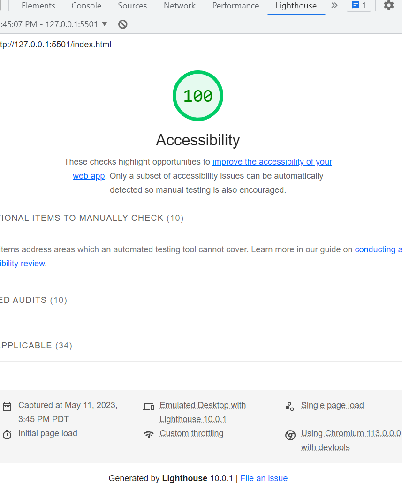

# cookie-stand

Lab 06

lab10b

# references

[css help with borders](https://developer.mozilla.org/en-US/docs/Web/CSS/border )
[highlight type](https://www.scaler.com/topics/css-highlight-text/)
[google fonts](https://fonts.google.com/specimen/Permanent+Marker/tester?category=Handwriting)
